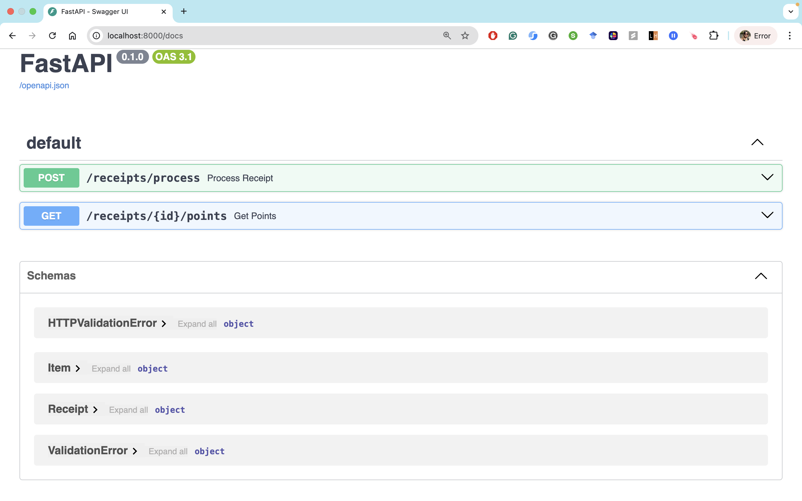
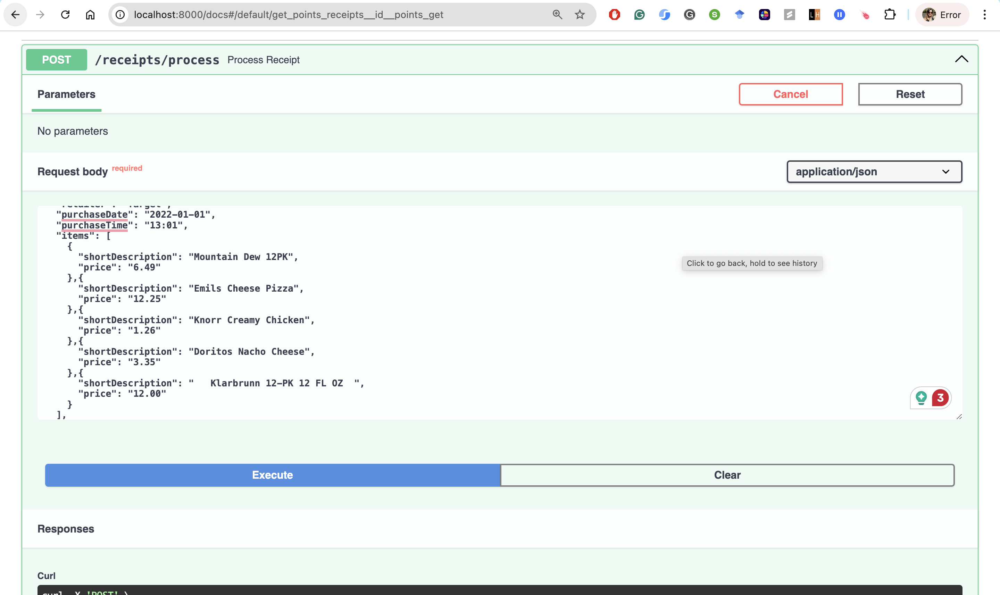
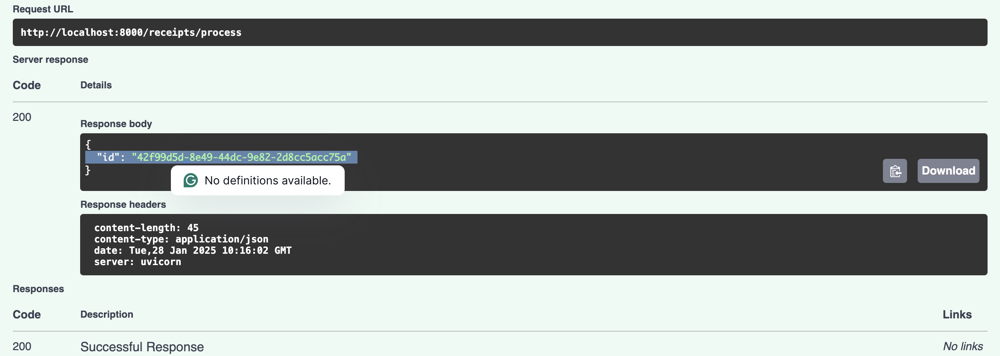
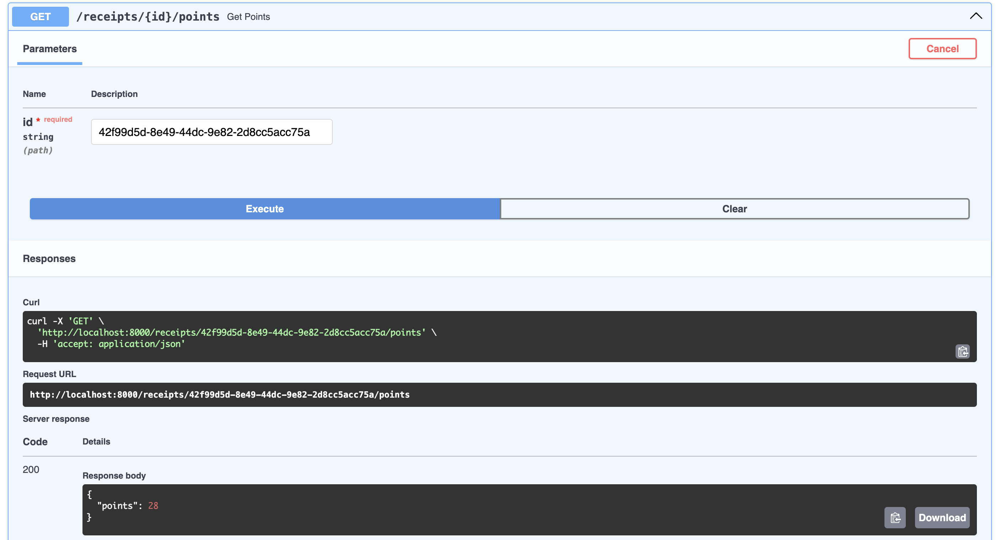

# Receipt Processor API

A web service built with FastAPI that processes retail receipts and awards points based on specific rules. The service calculates reward points by analyzing receipt attributes like purchase time, item counts, descriptions, and total amounts.

---

## **Features**

- Process receipts and calculate points using specific rules.
- Generate unique IDs for each receipt.
- Retrieve points for processed receipts by their unique IDs.

## **Points Calculation Rules**

Points are awarded based on the following criteria:

1. **Retailer Name**: One point for every alphanumeric character in the retailer name.
2. **Round Dollar Amount**: 50 points if the total is a round dollar amount with no cents.
3. **Quarter Multiple**: 25 points if the total is a multiple of 0.25.
4. **Item Count**: 5 points for every two items on the receipt.
5. **Item Description**: If the trimmed length of the item description is a multiple of 3, multiply the price by 0.2 and round up to the nearest integer.
6. **Total Amount**: 5 points if the total is greater than $10.00.
7. **Purchase Date**: 6 points if the day in the purchase date is odd.
8. **Purchase Time**: 10 points if the time of purchase is between 2:00 PM and 4:00 PM.

---

## **Data Models**

The API uses Pydantic models for data validation and serialization:

### Receipt Model
```python
class Receipt(BaseModel):
    retailer: str           # Retailer name (alphanumeric, spaces, -, & only)
    purchaseDate: str       # Date in YYYY-MM-DD format
    purchaseTime: str       # Time in HH:MM 24 hour format
    items: List[Item]       # List of purchased items (min 1 item)
    total: str             # Total amount in USD (format: XX.XX$ - decimal with 2 places)
```

### Item Model
```python
class Item(BaseModel):
    shortDescription: str   # Item description (alphanumeric, spaces, and hyphens only)
    price: str             # Price in USD (format: XX.XX$ - decimal with 2 places)
```

These models ensure:
- All required fields are present
- Data formats are correct (dates, times, prices)
- String patterns match expected formats
- At least one item is included in each receipt

---

## **API Endpoints**

### 1. `POST /receipts/process`
- **Description**: Process a receipt and return a unique ID.
- **Request Body**: Requires a valid receipt object.
- **Response**: Returns a unique receipt ID (UUID format).

**Request Details:**
- **URL**: `/receipts/process`
- **Method**: `POST`
- **Content-Type**: `application/json`

**Request Body Example:**
```json
{
  "retailer": "Target",
  "purchaseDate": "2022-01-01",
  "purchaseTime": "13:01",
  "items": [
    {
      "shortDescription": "Mountain Dew 12PK",
      "price": "6.49"
    }
  ],
  "total": "6.49"
}
```

**Successful Response:**
```json
{
  "id": "7fb1377b-b223-49d9-a31a-5a02701dd310"
}
```

**Error Responses:**
- `400 Bad Request`: The receipt is invalid.
- `404 NotFound`: No receipt found for that ID.

### 2. `GET /receipts/{id}/points`
- **Description**: Retrieve points for a specific receipt by its ID.
- **Response**: Returns the calculated points.

**Request Details:**
- **URL**: `/receipts/{id}/points`
- **Method**: `GET`
- **Parameters**: 
  - `id` (path parameter): The UUID of the processed receipt

**Successful Response:**
```json
{
  "points": 28
}
```

**Error Responses:**
- `404 Not Found`: Receipt ID does not exist
- `400 Bad Request`: Invalid receipt ID format

**Example Request:**
```bash
GET /receipts/7fb1377b-b223-49d9-a31a-5a02701dd310/points
```

---

## **Running with Docker**

### **Steps to Run the API with Docker**

1. **Build the Docker image**:
   ```bash
   docker build -t receipt-processor .
   ```

2. **Run the container**:
   ```bash
   docker run -p 8000:8000 receipt-processor
   ```

The API will be available at `http://localhost:8000/docs` for testing.


---

## **API Documentation & Testing**

### **Swagger Documentation**
- The API includes built-in Swagger documentation.
- Follow these steps to access it:
  1. Start the server.
  2. Visit [`http://localhost:8000/docs`](http://localhost:8000/docs) in your browser.
  3. Test the endpoints directly from the Swagger UI:
     - Submit receipts via the **POST** endpoint.
        


        Receipt is processed and a unique ID is returned.
        
     - Use the generated receipt ID to query the **GET** endpoint for points.
        

    <!--  -->
---
## **Examples**

### Example 1: Target Receipt

```json
{
  "retailer": "Target",
  "purchaseDate": "2022-01-01",
  "purchaseTime": "13:01",
  "items": [
    {
      "shortDescription": "Mountain Dew 12PK",
      "price": "6.49"
    },{
      "shortDescription": "Emils Cheese Pizza",
      "price": "12.25"
    },{
      "shortDescription": "Knorr Creamy Chicken",
      "price": "1.26"
    },{
      "shortDescription": "Doritos Nacho Cheese",
      "price": "3.35"
    },{
      "shortDescription": "   Klarbrunn 12-PK 12 FL OZ  ",
      "price": "12.00"
    }
  ],
  "total": "35.35"
}
```

**Total Points: 28**
```
Breakdown:
6 points - retailer name has 6 characters
10 points - 5 items (2 pairs @ 5 points each)
3 Points - "Emils Cheese Pizza" is 18 characters (a multiple of 3)
           item price of 12.25 * 0.2 = 2.45, rounded up is 3 points
3 Points - "Klarbrunn 12-PK 12 FL OZ" is 24 characters (a multiple of 3)
           item price of 12.00 * 0.2 = 2.4, rounded up is 3 points
6 points - purchase day is odd
```

### Example 2: M&M Corner Market Receipt

```json
{
  "retailer": "M&M Corner Market",
  "purchaseDate": "2022-03-20",
  "purchaseTime": "14:33",
  "items": [
    {
      "shortDescription": "Gatorade",
      "price": "2.25"
    },{
      "shortDescription": "Gatorade",
      "price": "2.25"
    },{
      "shortDescription": "Gatorade",
      "price": "2.25"
    },{
      "shortDescription": "Gatorade",
      "price": "2.25"
    }
  ],
  "total": "9.00"
}
```

**Total Points: 109**
```
Breakdown:
50 points - total is a round dollar amount
25 points - total is a multiple of 0.25
14 points - retailer name (M&M Corner Market) has 14 alphanumeric characters
            note: '&' is not alphanumeric
10 points - 2:33pm is between 2:00pm and 4:00pm
10 points - 4 items (2 pairs @ 5 points each)
```

---


### **Steps to Set Up in Development Mode**

1. **Create and activate a virtual environment**:
   ```bash
   python3 -m venv venv
   source venv/bin/activate  # For Windows: venv\Scripts\activate
   ```

2. **Install dependencies**:
   ```bash
   pip install -r requirements.txt
   ```

3. **Run the development server**:
   ```bash
   fastapi run main.py
   ```

The API will be available at `http://localhost:8000/docs` for testing.

---

## **Running Tests**

The project includes comprehensive test coverage for various scenarios.

### **Run Tests**
Run the tests using the `pytest` framework:
```bash
pytest test.py 
```

### **Test Coverage**

#### **1. Basic Receipt Processing Tests**
- **`test_process_receipt`**: Validates receipt processing and ID generation.
- **`test_get_points_market`**: Tests points calculation for M&M Corner Market receipt (expected: 109 points).
- **`test_get_points_target`**: Tests points calculation for Target receipt (expected: 28 points).

#### **2. Error Handling Tests**
- **`test_receipt_not_found_basic`**: Tests behavior for non-existent receipt IDs.
- **`test_invalid_receipt_format`**: Ensures proper handling of invalid receipt formats.

#### **3. Parameterized Tests**
- **Invalid Receipt Variations**:
  - Missing required fields.
  - Incorrect date, time, or price formats.
  - Empty items list.
- **Invalid ID Variations**:
  - Random UUIDs.
  - Improper ID formats.
  - Null or undefined values.

---


## **Directory Structure**
```
.
├── main.py               # FastAPI application entry point
├── Dockerfile            # Docker configuration
├── requirements.txt      # Python dependencies
├── test.py               # Test cases for the API
├── README.md             # Project documentation
```

---

